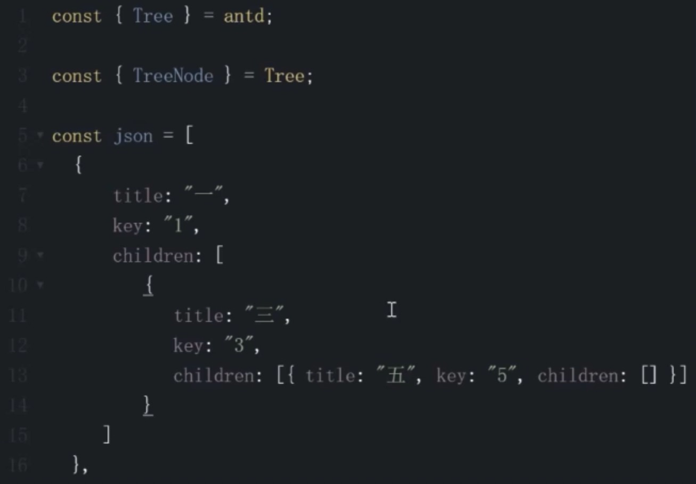
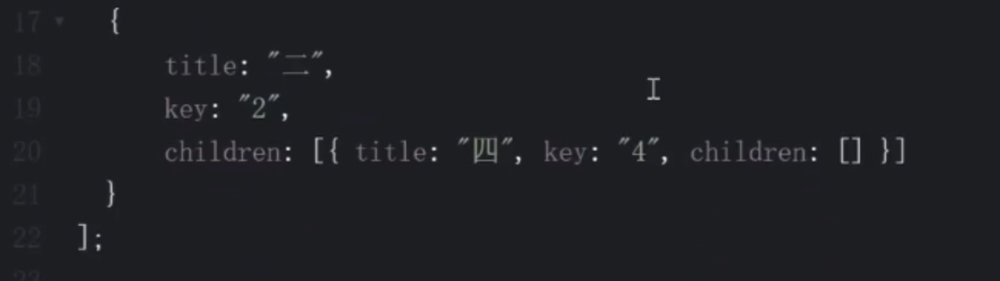
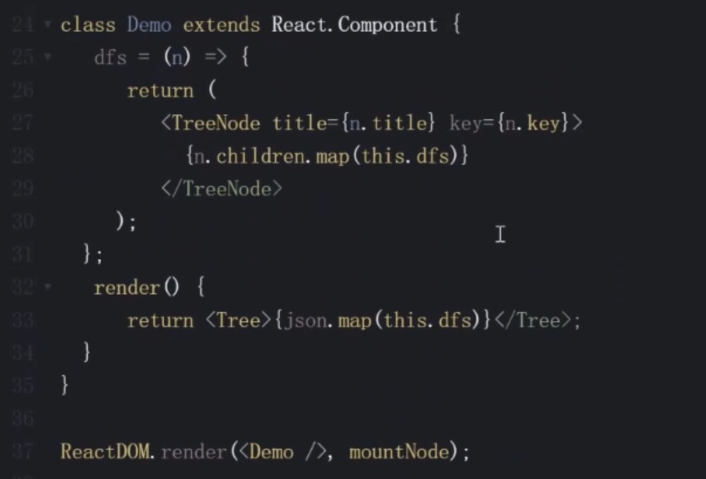

# js-algorithm

JavaScript 实现数据结构与算法


## Leetcode 算法练习

## [933. 最近的请求次数](https://leetcode-cn.com/problems/number-of-recent-calls/)

难度简单68收藏分享切换为英文接收动态反馈

写一个 `RecentCounter` 类来计算特定时间范围内最近的请求。

请你实现 `RecentCounter` 类：

- `RecentCounter()` 初始化计数器，请求数为 0 。
- `int ping(int t)` 在时间 `t` 添加一个新请求，其中 `t` 表示以毫秒为单位的某个时间，并返回过去 3000 毫秒内发生的所有请求数（包括新请求）。确切地说，返回在 `[t-3000, t]` 内发生的请求数。

保证每次对 `ping` 的调用都使用比之前更大的 `t` 值。

 

**示例 1：**

```js
输入：
["RecentCounter", "ping", "ping", "ping", "ping"]
[[], [1], [100], [3001], [3002]]
输出：
[null, 1, 2, 3, 3]

解释：
RecentCounter recentCounter = new RecentCounter();
recentCounter.ping(1);     // requests = [1]，范围是 [-2999,1]，返回 1
recentCounter.ping(100);   // requests = [<u>1</u>, <u>100</u>]，范围是 [-2900,100]，返回 2
recentCounter.ping(3001);  // requests = [<u>1</u>, <u>100</u>, <u>3001</u>]，范围是 [1,3001]，返回 3
recentCounter.ping(3002);  // requests = [1, <u>100</u>, <u>3001</u>, <u>3002</u>]，范围是 [2,3002]，返回 3
```

 

**提示：**

- `1 <= t <= 104`
- 保证每次对 `ping` 的调用都使用比之前更大的 `t` 值
- 至多调用 `ping` 方法 `104` 次

通过次数18,683

提交次数25,945

```js
var RecentCounter = function() {
    this.queue = [];
};

/** 
 * @param {number} t
 * @return {number}
 */
RecentCounter.prototype.ping = function(t) {
    this.queue.push(t);
    while (this.queue[0] < t - 3000) {
        this.queue.shift();
    }
    return this.queue.length;
};

/**
 * Your RecentCounter object will be instantiated and called as such:
 * var obj = new RecentCounter()
 * var param_1 = obj.ping(t)
 */
```


## [237. 删除链表中的节点](https://leetcode-cn.com/problems/delete-node-in-a-linked-list/)

难度简单778收藏分享切换为英文接收动态反馈

请编写一个函数，使其可以删除某个链表中给定的（非末尾）节点。传入函数的唯一参数为 **要被删除的节点** 。

 

现有一个链表 -- head = [4,5,1,9]，它可以表示为:


 

**示例 1：**

```js
输入：head = [4,5,1,9], node = 5
输出：[4,1,9]
解释：给定你链表中值为 5 的第二个节点，那么在调用了你的函数之后，该链表应变为 4 -> 1 -> 9.
```

**示例 2：**

```js
输入：head = [4,5,1,9], node = 1
输出：[4,5,9]
解释：给定你链表中值为 1 的第三个节点，那么在调用了你的函数之后，该链表应变为 4 -> 5 -> 9.
```

 

**提示：**

- 链表至少包含两个节点。
- 链表中所有节点的值都是唯一的。
- 给定的节点为非末尾节点并且一定是链表中的一个有效节点。
- 不要从你的函数中返回任何结果。

通过次数134,360

提交次数161,578


```js
/**
 * Definition for singly-linked list.
 * function ListNode(val) {
 *     this.val = val;
 *     this.next = null;
 * }
 */
/**
 * @param {ListNode} node
 * @return {void} Do not return anything, modify node in-place instead.
 */
var deleteNode = function(node) {
    node.val = node.next.val;
    node.next = node.next.next;
};
```


## [206. 反转链表](https://leetcode-cn.com/problems/reverse-linked-list/)

难度简单1287收藏分享切换为英文接收动态反馈

反转一个单链表。

**示例:**

```js
输入: 1->2->3->4->5->NULL
输出: 5->4->3->2->1->NULL
```

**进阶:**
你可以迭代或递归地反转链表。你能否用两种方法解决这道题？

通过次数352,126

提交次数497,910

```js
/**
 * Definition for singly-linked list.
 * function ListNode(val) {
 *     this.val = val;
 *     this.next = null;
 * }
 */
/**
 * @param {ListNode} head
 * @return {ListNode}
 */
var reverseList = function(head) {
    console.log(head,'head')
    let p1 = head;
    let p2 = null;
    while (p1) {
        console.log(p1,'我是p1===========》')
        const tmp = p1.next;
        console.log(tmp,'我是tmp')
        p1.next = p2;
         console.log(p1,'我是p1改变之后=====》')
        p2 = p1;
        p1 = tmp;
    }
    return p2;
};
```

## [2. 两数相加](https://leetcode-cn.com/problems/add-two-numbers/)

难度中等5110收藏分享切换为英文接收动态反馈

给出两个 **非空** 的链表用来表示两个非负的整数。其中，它们各自的位数是按照 **逆序** 的方式存储的，并且它们的每个节点只能存储 **一位** 数字。

如果，我们将这两个数相加起来，则会返回一个新的链表来表示它们的和。

您可以假设除了数字 0 之外，这两个数都不会以 0 开头。

**示例：**

```js
输入：(2 -> 4 -> 3) + (5 -> 6 -> 4)
输出：7 -> 0 -> 8
原因：342 + 465 = 807
```

通过次数597,843

提交次数1,543,436


```js
/**
 * Definition for singly-linked list.
 * function ListNode(val, next) {
 *     this.val = (val===undefined ? 0 : val)
 *     this.next = (next===undefined ? null : next)
 * }
 */
/**
 * @param {ListNode} l1
 * @param {ListNode} l2
 * @return {ListNode}
 */
var addTwoNumbers = function(l1, l2) {
    const l3 = new ListNode(0);
    let p1 = l1;
    let p2 = l2;
    let p3 = l3;
    let carry = 0;
    while (p1 || p2) {
        const v1 = p1 ? p1.val : 0;
        const v2 = p2 ? p2.val : 0;
        const val = v1 + v2 + carry;
        carry = Math.floor(val / 10);
        p3.next = new ListNode(val % 10);
        if (p1) p1 = p1.next;
        if (p2) p2 = p2.next;
        p3 = p3.next;
        console.log(l3, 'l3=======0900000')
        console.log(p3, 'p3=======0800000')
    }
    if( carry ) {
        p3.next = new ListNode(carry);
    }
    return l3.next;
};
```

## [83. 删除排序链表中的重复元素](https://leetcode-cn.com/problems/remove-duplicates-from-sorted-list/)

难度简单413收藏分享切换为英文接收动态反馈

给定一个排序链表，删除所有重复的元素，使得每个元素只出现一次。

**示例 1:**

```js
输入: 1->1->2
输出: 1->2
```

**示例 2:**

```js
输入: 1->1->2->3->3
输出: 1->2->3
```

通过次数150,560

提交次数291,739


```js
/**
 * Definition for singly-linked list.
 * function ListNode(val) {
 *     this.val = val;
 *     this.next = null;
 * }
 */
/**
 * @param {ListNode} head
 * @return {ListNode}
 */
var deleteDuplicates = function(head) {
    let p = head;
    while (p && p.next) {
        if (p.val === p.next.val) {
            p.next = p.next.next
        } else {
            p = p.next;
        }
    }
    return head;
};
```

## [141. 环形链表](https://leetcode-cn.com/problems/linked-list-cycle/)

难度简单829收藏分享切换为英文接收动态反馈

给定一个链表，判断链表中是否有环。

如果链表中有某个节点，可以通过连续跟踪 `next` 指针再次到达，则链表中存在环。 为了表示给定链表中的环，我们使用整数 `pos` 来表示链表尾连接到链表中的位置（索引从 0 开始）。 如果 `pos` 是 `-1`，则在该链表中没有环。**注意：`pos` 不作为参数进行传递**，仅仅是为了标识链表的实际情况。

如果链表中存在环，则返回 `true` 。 否则，返回 `false` 。

 

**进阶：**

你能用 *O(1)*（即，常量）内存解决此问题吗？

 

**示例 1：**


```js
输入：head = [3,2,0,-4], pos = 1
输出：true
解释：链表中有一个环，其尾部连接到第二个节点。
```

**示例 2：**


```js
输入：head = [1,2], pos = 0
输出：true
解释：链表中有一个环，其尾部连接到第一个节点。
```

**示例 3：**


```js
输入：head = [1], pos = -1
输出：false
解释：链表中没有环。
```

 

**提示：**

- 链表中节点的数目范围是 `[0, 104]`
- `-105 <= Node.val <= 105`
- `pos` 为 `-1` 或者链表中的一个 **有效索引** 。

通过次数273,283

提交次数543,745


```js
/**
 * Definition for singly-linked list.
 * function ListNode(val) {
 *     this.val = val;
 *     this.next = null;
 * }
 */

/**
 * @param {ListNode} head
 * @return {boolean}
 */
var hasCycle = function(head) {
    let p1 = head;
    let p2 = head;
    while (p1 && p2 && p2.next) {
        p1 = p1.next;
        p2 = p2.next.next;
        if (p1 === p2) {
            return true;
        }
    }
    return false
};
```


## [349. 两个数组的交集](https://leetcode-cn.com/problems/intersection-of-two-arrays/)

难度简单240收藏分享切换为英文接收动态反馈

给定两个数组，编写一个函数来计算它们的交集。

 

**示例 1：**

```
输入：nums1 = [1,2,2,1], nums2 = [2,2]
输出：[2]
```

**示例 2：**

```
输入：nums1 = [4,9,5], nums2 = [9,4,9,8,4]
输出：[9,4]
```

 

**说明：**

- 输出结果中的每个元素一定是唯一的。
- 我们可以不考虑输出结果的顺序。

通过次数98,926

提交次数139,409

```js
/**
 * @param {number[]} nums1
 * @param {number[]} nums2
 * @return {number[]}
 */
//方法一：
// var intersection = function(nums1, nums2) {
//     return [...new Set(nums1)].filter(n => nums2.includes(n))
// };
// 方法二：
var intersection = function(nums1, nums2) {
    const map = new Map();
    nums1.forEach(n => {
         map.set(n, true)
    })
    const res = [];
    nums2.forEach(n => {
        if(map.get(n)) {
            res.push(n);
            map.delete(n)
        }      
    })
    return res;
};
```

## [20. 有效的括号](https://leetcode-cn.com/problems/valid-parentheses/)

难度简单1924收藏分享切换为英文接收动态反馈

给定一个只包括 `'('`，`')'`，`'{'`，`'}'`，`'['`，`']'` 的字符串，判断字符串是否有效。

有效字符串需满足：

1. 左括号必须用相同类型的右括号闭合。
2. 左括号必须以正确的顺序闭合。

注意空字符串可被认为是有效字符串。

**示例 1:**

```js
输入: "()"
输出: true
```

**示例 2:**

```js
输入: "()[]{}"
输出: true
```

**示例 3:**

```js
输入: "(]"
输出: false
```

**示例 4:**

```js
输入: "([)]"
输出: false
```

**示例 5:**

```js
输入: "{[]}"
输出: true
```

通过次数436,165

提交次数1,011,029

```js
/**
 * @param {string} s
 * @return {boolean}
 */
// var isValid = function(s) {
//     if(s.length % 2 === 1) {
//         return false;
//     }
//     const stack = [];
//     for (i = 0; i < s.length; i++) {
//         const c = s[i];
//         if (c === '(' || c === '{' || c === '[') {
//             stack.push(c);
//         } else {
//             const t = stack[stack.length - 1];
//             if (
//                 (t === '(' && c === ')') ||
//                 (t === '{' && c === '}') ||
//                 (t === '[' && c === ']')
//             ) {
//                 stack.pop();
//             } else {
//                 return false;
//             }
//         }
//     }
//     return stack.length === 0;
// };
//优化后的
var isValid = function(s) {
    if(s.length % 2 === 1) {
        return false;
    }
    const stack = [];
    const map = new Map();
    map.set('(', ')');
    map.set('[', ']');
    map.set('{', '}');
    for (i = 0; i < s.length; i++) {
        const c = s[i];
        if (map.has(c)) {
            stack.push(c);
        } else {
            const t = stack[stack.length - 1];
            if (map.get(t) === c) {
                stack.pop();
            } else {
                return false;
            }
        }
    }
    return stack.length === 0;
};
```

## [1. 两数之和](https://leetcode-cn.com/problems/two-sum/)

难度简单9389收藏分享切换为英文接收动态反馈

给定一个整数数组 `nums` 和一个目标值 `target`，请你在该数组中找出和为目标值的那 **两个** 整数，并返回他们的数组下标。

你可以假设每种输入只会对应一个答案。但是，数组中同一个元素不能使用两遍。

 

**示例:**

```
给定 nums = [2, 7, 11, 15], target = 9

因为 nums[0] + nums[1] = 2 + 7 = 9
所以返回 [0, 1]
```

通过次数1,473,821

提交次数2,965,004

```js
/**
 * @param {number[]} nums
 * @param {number} target
 * @return {number[]}
 */
var twoSum = function(nums, target) {
    const map = new Map();
    for (let i = 0; i < nums.length; i++) {
        const n = nums[i];
        const n2 = target - n;
        if (map.has(n2)) {
            return [map.get(n2), i]
        } else {
            map.set(n, i)
        }
    }
};
```

## [3. 无重复字符的最长子串](https://leetcode-cn.com/problems/longest-substring-without-repeating-characters/)

难度中等4476收藏分享切换为英文接收动态反馈

给定一个字符串，请你找出其中不含有重复字符的 **最长子串** 的长度。

**示例 1:**

```js
输入: "abcabcbb"
输出: 3 
解释: 因为无重复字符的最长子串是 "abc"，所以其长度为 3。
```

**示例 2:**

```js
输入: "bbbbb"
输出: 1
解释: 因为无重复字符的最长子串是 "b"，所以其长度为 1。
```

**示例 3:**

```js
输入: "pwwkew"
输出: 3
解释: 因为无重复字符的最长子串是 "wke"，所以其长度为 3。
     请注意，你的答案必须是 子串 的长度，"pwke" 是一个子序列，不是子串。
```

通过次数696,833

提交次数1,948,213

```js
/**
 * @param {string} s
 * @return {number}
 */
var lengthOfLongestSubstring = function(s) {
    let l = 0;
    let res = 0;
    const map = new Map();
    for (let r = 0; r < s.length; r++) {
        if (map.has(s[r]) && map.get(s[r]) >= l) {
            l = map.get(s[r]) + 1;
        }
        res = Math.max(res, r - l + 1);
        map.set(s[r], r);
    }
    return res;
};
```


## [76. 最小覆盖子串](https://leetcode-cn.com/problems/minimum-window-substring/)

难度困难793收藏分享切换为英文接收动态反馈

给你一个字符串 S、一个字符串 T 。请你设计一种算法，可以在 O(n) 的时间复杂度内，从字符串 S 里面找出：包含 T 所有字符的最小子串。

 

**示例：**

```js
输入：S = "ADOBECODEBANC", T = "ABC"
输出："BANC"
```

 

**提示：**

- 如果 S 中不存这样的子串，则返回空字符串 `""`。
- 如果 S 中存在这样的子串，我们保证它是唯一的答案。

通过次数84,273

提交次数213,812

```js
/**
 * @param {string} s
 * @param {string} t
 * @return {string}
 */
var minWindow = function(s, t) {
    let l = 0;
    let r = 0;
    const need = new Map();
    for (let c of t) {
        need.set(c, need.has(c) ? need.get(c) + 1 : 1)
    }
    let needType = need.size;
    let res = '';
    while (r < s.length) {
        const c = s[r];
        if(need.has(c)) {
            need.set(c, need.get(c) - 1)
            if(need.get(c) === 0) needType -= 1;
        }
        while(needType === 0) {
            const newRes = s.substring(l, r + 1);
            if (!res || newRes.length < res.length) {
                res = newRes;
            }
            const c2 = s[l];
            if (need.has(c2)) {
                need.set(c2, need.get(c2) + 1)
                if(need.get(c2) === 1) needType += 1;
            }
            l += 1;
        }
        r++;
    }
    return res;
};
```

## [104. 二叉树的最大深度](https://leetcode-cn.com/problems/maximum-depth-of-binary-tree/)

难度简单721收藏分享切换为英文接收动态反馈

给定一个二叉树，找出其最大深度。

二叉树的深度为根节点到最远叶子节点的最长路径上的节点数。

**说明:** 叶子节点是指没有子节点的节点。

**示例：**
给定二叉树 `[3,9,20,null,null,15,7]`，

```js
    3
   / \
  9  20
    /  \
   15   7
```

返回它的最大深度 3 。

```js
/**
 * Definition for a binary tree node.
 * function TreeNode(val) {
 *     this.val = val;
 *     this.left = this.right = null;
 * }
 */
/**
 * @param {TreeNode} root
 * @return {number}
 */
var maxDepth = function(root) {
    let res = 0;
    const dfs = (n, l) => {
        if (!n) { return }
        if (!n.left && !n.right) {
            res = Math.max(res, l)
        }
        dfs(n.left, l + 1);
        dfs(n.right,l + 1);
    };
    dfs(root, 1);
    return res;
};
```


## [111. 二叉树的最小深度](https://leetcode-cn.com/problems/minimum-depth-of-binary-tree/)

难度简单383收藏分享切换为英文接收动态反馈

给定一个二叉树，找出其最小深度。

最小深度是从根节点到最近叶子节点的最短路径上的节点数量。

**说明:** 叶子节点是指没有子节点的节点。

**示例:**

给定二叉树 `[3,9,20,null,null,15,7]`,

```js
    3
   / \
  9  20
    /  \
   15   7
```

返回它的最小深度  2.

```js
/**
 * Definition for a binary tree node.
 * function TreeNode(val, left, right) {
 *     this.val = (val===undefined ? 0 : val)
 *     this.left = (left===undefined ? null : left)
 *     this.right = (right===undefined ? null : right)
 * }
 */
/**
 * @param {TreeNode} root
 * @return {number}
 */
var minDepth = function(root) {
    if (!root) {
        return 0;
    }
    const q = [[root, 1]];
    while (q.length) {
        const [n, l] = q.shift();
        if (!n.left && !n.right) {
            return l;
        }
        if (n.left) {
            q.push([n.left,l + 1]);
        }
        if (n.right) {
            q.push([n.right,l + 1]);
        }
    }
}
```


## [102. 二叉树的层序遍历](https://leetcode-cn.com/problems/binary-tree-level-order-traversal/)

难度中等671收藏分享切换为英文接收动态反馈

给你一个二叉树，请你返回其按 **层序遍历** 得到的节点值。 （即逐层地，从左到右访问所有节点）。

 

**示例：**
二叉树：`[3,9,20,null,null,15,7]`,

```js
    3
   / \
  9  20
    /  \
   15   7
```

返回其层次遍历结果：

```js
[
  [3],
  [9,20],
  [15,7]
]
```

```js
/**
 * Definition for a binary tree node.
 * function TreeNode(val) {
 *     this.val = val;
 *     this.left = this.right = null;
 * }
 */
/**
 * @param {TreeNode} root
 * @return {number[][]}
 */
var levelOrder = function(root) {
    if (!root) {
        return [];
    } 
    const q = [[root, 0]];
    const res = [];
    while (q.length) {
        const [n, level] = q.shift();
        if (!res[level]) {
            res.push([n.val]);
        } else {
            res[level].push(n.val)
        }
        if (n.left) {
            q.push([n.left, level + 1]);
        }
        if (n.right) {
            q.push([n.right, level + 1]);
        }
    }
    return res;
};

法二：
/**
 * Definition for a binary tree node.
 * function TreeNode(val) {
 *     this.val = val;
 *     this.left = this.right = null;
 * }
 */
/**
 * @param {TreeNode} root
 * @return {number[][]}
 */
// var levelOrder = function(root) {
//     if (!root) {
//         return [];
//     } 
//     const q = [[root, 0]];
//     const res = [];
//     while (q.length) {
//         const [n, level] = q.shift();
//         if (!res[level]) {
//             res.push([n.val]);
//         } else {
//             res[level].push(n.val)
//         }
//         if (n.left) {
//             q.push([n.left, level + 1]);
//         }
//         if (n.right) {
//             q.push([n.right, level + 1]);
//         }
//     }
//     return res;
// };

//法二：
var levelOrder = function(root) {
    if (!root) {
        return [];
    }
    const q = [root];
    const res = [];
    while(q.length) {
        let len = q.length;
        res.push([]);
        while(len--) {
            const n = q.shift();
            res[res.length - 1].push(n.val);
            if(n.left) {
                q.push(n.left)
            }
            if(n.right) {
                q.push(n.right)
            }
        }
    }
    return res;
}
```


## [94. 二叉树的中序遍历](https://leetcode-cn.com/problems/binary-tree-inorder-traversal/)

难度中等751收藏分享切换为英文接收动态反馈

给定一个二叉树，返回它的*中序* 遍历。

**示例:**

```
输入: [1,null,2,3]
   1
    \
     2
    /
   3

输出: [1,3,2]
```

**进阶:** 递归算法很简单，你可以通过迭代算法完成吗？

通过次数285,017

提交次数385,849

```js
/**
 * Definition for a binary tree node.
 * function TreeNode(val, left, right) {
 *     this.val = (val===undefined ? 0 : val)
 *     this.left = (left===undefined ? null : left)
 *     this.right = (right===undefined ? null : right)
 * }
 */
/**
 * @param {TreeNode} root
 * @return {number[]}
 */
// var inorderTraversal = function(root) {
//     const res = [];
//     const rec = (n) => {
//         if(!n) {
//             return
//         }
//         rec(n.left);
//         res.push(n.val);
//         rec(n.right);
//     }
//     rec(root);
//     return res;
// };

// 法二：
var inorderTraversal = function(root) {
    const res = [];
    const stack = [];
    let p = root;
    while (stack.length || p) {
        while (p) {
            stack.push(p);
            p = p.left;
        }
        const n = stack.pop();
        res.push(n.val);
        p = n.right;
    }

    return res;
}
```


## [112. 路径总和](https://leetcode-cn.com/problems/path-sum/)

难度简单447收藏分享切换为英文接收动态反馈

给定一个二叉树和一个目标和，判断该树中是否存在根节点到叶子节点的路径，这条路径上所有节点值相加等于目标和。

**说明:** 叶子节点是指没有子节点的节点。

**示例:** 
给定如下二叉树，以及目标和 `sum = 22`，

```
              5
             / \
            4   8
           /   / \
          11  13  4
         /  \      \
        7    2      1
```

返回 `true`, 因为存在目标和为 22 的根节点到叶子节点的路径 `5->4->11->2`。

```js
/**
 * Definition for a binary tree node.
 * function TreeNode(val) {
 *     this.val = val;
 *     this.left = this.right = null;
 * }
 */
/**
 * @param {TreeNode} root
 * @param {number} sum
 * @return {boolean}
 */
var hasPathSum = function(root, sum) {
    if(!root) return false;
    let res = false;
    const dfs = (n, s) => {
        if (!n.left && !n.right && s === sum) {
            res = true;
        }
        if (n.left) dfs(n.left, s + n.left.val)
        if (n.right) dfs(n.right, s + n.right.val)
    }
    dfs(root, root.val);
    return res;
};
```


## 前端与树



!(README.assets/image-20201021154244543.png)






## [65. 有效数字](https://leetcode-cn.com/problems/valid-number/)

难度困难158收藏分享切换为英文接收动态反馈

验证给定的字符串是否可以解释为十进制数字。

例如:

```js
"0"` => `true`
`" 0.1 "` => `true`
`"abc"` => `false`
`"1 a"` => `false`
`"2e10"` => `true`
`" -90e3  "` => `true`
`" 1e"` => `false`
`"e3"` => `false`
`" 6e-1"` => `true`
`" 99e2.5 "` => `false`
`"53.5e93"` => `true`
`" --6 "` => `false`
`"-+3"` => `false`
`"95a54e53"` => `false
```

**说明:** 我们有意将问题陈述地比较模糊。在实现代码之前，你应当事先思考所有可能的情况。这里给出一份可能存在于有效十进制数字中的字符列表：

- 数字 0-9
- 指数 - "e"
- 正/负号 - "+"/"-"
- 小数点 - "."

当然，在输入中，这些字符的上下文也很重要。

**更新于 2015-02-10:**
`C++`函数的形式已经更新了。如果你仍然看见你的函数接收 `const char *` 类型的参数，请点击重载按钮重置你的代码。

通过次数19,661

提交次数93,309

```js
/**
 * @param {string} s
 * @return {boolean}
 */
var isNumber = function(s) {
    const graph = {
        0: { 'blank': 0, 'sign': 1, '.': 2, 'digit': 6},
        1: { 'digit': 6, '.': 2},
        2: { 'digit': 3},
        3: { 'digit': 3, 'e': 4},
        4: { 'digit': 5, 'sign': 7},
        5: { 'digit': 5},
        6: { 'digit': 6, '.': 3, 'e': 4},
        7: { 'digit': 5},
    };
    let state = 0;
    for (c of s.trim()) {
        if (c >= '0' && c <= '9') {
            c = 'digit';
        } else if (c === ' ') {
            c = 'blank';
        } else if (c === '+' || c === '-') {
            c = 'sign';
        }
        state = graph[state][c];
        if (state === undefined) {
            return false;
        }
    }
    if (state === 3 || state === 5 || state === 6) {
        return true;
    }
    return false;
};
```


## [417. 太平洋大西洋水流问题](https://leetcode-cn.com/problems/pacific-atlantic-water-flow/)

难度中等162收藏分享切换为英文接收动态反馈

给定一个 `m x n` 的非负整数矩阵来表示一片大陆上各个单元格的高度。“太平洋”处于大陆的左边界和上边界，而“大西洋”处于大陆的右边界和下边界。

规定水流只能按照上、下、左、右四个方向流动，且只能从高到低或者在同等高度上流动。

请找出那些水流既可以流动到“太平洋”，又能流动到“大西洋”的陆地单元的坐标。

 

**提示：**

1. 输出坐标的顺序不重要
2. *m* 和 *n* 都小于150

 

**示例：**

 

```js
给定下面的 5x5 矩阵:

  太平洋 ~   ~   ~   ~   ~ 
       ~  1   2   2   3  (5) *
       ~  3   2   3  (4) (4) *
       ~  2   4  (5)  3   1  *
       ~ (6) (7)  1   4   5  *
       ~ (5)  1   1   2   4  *
          *   *   *   *   * 大西洋

返回:

[[0, 4], [1, 3], [1, 4], [2, 2], [3, 0], [3, 1], [4, 0]] (上图中带括号的单元).
```

 

通过次数12,543

提交次数28,983

```js
/**
 * @param {number[][]} matrix
 * @return {number[][]}
 */

var pacificAtlantic = function(matrix) {
    // 矩阵无值或不是二维
    if (!matrix || !matrix[0]) return [];
    
    const row = matrix.length;
    const column = matrix[0].length;

    // 记录能流到太平洋的坐标
    const flowT = Array.from({length: row}, () => new Array(column).fill(false));
    // 记录能流到大西洋的坐标
    const flowD = Array.from({length: row}, () => {
        return new Array(column).fill(false);
    });
    // console.log(row,column,flowT,flowD);

    // 深度优先遍历 (r,c) 当前节点的坐标 flow：flowT/flowD
    const dfs = (r, c, flow) => {
        flow[r][c] = true;
        // 遍历相邻节点，上下左右四个节点
        [[r-1,c],[r+1,c],[r,c-1],[r,c+1]].forEach(([nextR,nextC]) => {
            if(
                // 保证节点在矩阵中
                nextR >= 0 && nextR < row &&
                nextC >= 0 && nextC < column &&
                // 防止死循环，保证之前没访问该节点
                !flow[nextR][nextC] && 
                // 保证逆流而上
                matrix[nextR][nextC] >= matrix[r][c]
            ){
                dfs(nextR, nextC, flow);
            }
        });
    };

    //  沿着海岸线逆流而上
    for(let i = 0; i < row; i++){
        // 第1列
        dfs(i, 0, flowT);
        // 最后1列
        dfs(i, column - 1, flowD);
    }
    for(let j = 0; j < column; j++){
        // 第一行
        dfs(0, j, flowT);
        // 最后一行
        dfs(row - 1, j, flowD);
    }

    // 收集能流到两个大洋的坐标 
    const res = [];
    for (let r = 0; r < row; r++){
        for(let c = 0; c < column; c++){
            if(flowT[r][c] && flowD[r][c]){
                res.push([r,c]);
            }
        }
    }
    return res;
};

```


## [133. 克隆图](https://leetcode-cn.com/problems/clone-graph/)

难度中等276

给你无向 **[连通](https://baike.baidu.com/item/连通图/6460995?fr=aladdin)** 图中一个节点的引用，请你返回该图的 [**深拷贝**](https://baike.baidu.com/item/深拷贝/22785317?fr=aladdin)（克隆）。

图中的每个节点都包含它的值 `val`（`int`） 和其邻居的列表（`list[Node]`）。

```js
class Node {
    public int val;
    public List<Node> neighbors;
}
```

 

**测试用例格式：**

简单起见，每个节点的值都和它的索引相同。例如，第一个节点值为 1（`val = 1`），第二个节点值为 2（`val = 2`），以此类推。该图在测试用例中使用邻接列表表示。

**邻接列表** 是用于表示有限图的无序列表的集合。每个列表都描述了图中节点的邻居集。

给定节点将始终是图中的第一个节点（值为 1）。你必须将 **给定节点的拷贝** 作为对克隆图的引用返回。

 

**示例 1：**


```js
输入：adjList = [[2,4],[1,3],[2,4],[1,3]]
输出：[[2,4],[1,3],[2,4],[1,3]]
解释：
图中有 4 个节点。
节点 1 的值是 1，它有两个邻居：节点 2 和 4 。
节点 2 的值是 2，它有两个邻居：节点 1 和 3 。
节点 3 的值是 3，它有两个邻居：节点 2 和 4 。
节点 4 的值是 4，它有两个邻居：节点 1 和 3 。
```

**示例 2：**


```js
输入：adjList = [[]]
输出：[[]]
解释：输入包含一个空列表。该图仅仅只有一个值为 1 的节点，它没有任何邻居。
```

**示例 3：**

```js
输入：adjList = []
输出：[]
解释：这个图是空的，它不含任何节点。
```

**示例 4：**


```js
输入：adjList = [[2],[1]]
输出：[[2],[1]]
```

 

**提示：**

1. 节点数不超过 100 。
2. 每个节点值 `Node.val` 都是唯一的，`1 <= Node.val <= 100`。
3. 无向图是一个[简单图](https://baike.baidu.com/item/简单图/1680528?fr=aladdin)，这意味着图中没有重复的边，也没有自环。
4. 由于图是无向的，如果节点 *p* 是节点 *q* 的邻居，那么节点 *q* 也必须是节点 *p* 的邻居。
5. 图是连通图，你可以从给定节点访问到所有节点。

通过次数49,327

提交次数75,764

```js
/**
 * // Definition for a Node.
 * function Node(val, neighbors) {
 *    this.val = val === undefined ? 0 : val;
 *    this.neighbors = neighbors === undefined ? [] : neighbors;
 * };
 */

/**
 * @param {Node} node
 * @return {Node}
 */

// //深度优先遍历
// var cloneGraph = function(node) {
//     if (!node) {
//         return
//     }
//     const visited = new Map();
//     const dfs = (n) => {
//         const nCopy = new Node(n.val);
//         visited.set(n, nCopy);
//         (n.neighbors || []).forEach(ne => {
//             if(!visited.has(ne)) {
//                 dfs(ne);
//             }
//             nCopy.neighbors.push(visited.get(ne))
//         })
//     }
//     dfs(node);
//     return visited.get(node);
// };

//广度优先遍历
var cloneGraph = function(node) {
    if (!node) {
        return
    }
    const visited = new Map();
    visited.set(node, new Node(node.val));
    const q = [node];
    while(q.length) {
        const n = q.shift();
        (n.neighbors || []).forEach(ne => {
            if (!visited.has(ne)) {
                q.push(ne);
                visited.set(ne, new Node(ne.val));
            }
            visited.get(n).neighbors.push(visited.get(ne));
        })
    }
    return visited.get(node);
};
```


## [215. 数组中的第K个最大元素](https://leetcode-cn.com/problems/kth-largest-element-in-an-array/)

难度中等753

在未排序的数组中找到第 **k** 个最大的元素。请注意，你需要找的是数组排序后的第 k 个最大的元素，而不是第 k 个不同的元素。

**示例 1:**

```js
输入: [3,2,1,5,6,4] 和 k = 2
输出: 5
```

**示例 2:**

```js
输入: [3,2,3,1,2,4,5,5,6] 和 k = 4
输出: 4
```

**说明:**

你可以假设 k 总是有效的，且 1 ≤ k ≤ 数组的长度。

通过次数214,696

提交次数333,381

```js
class MinHeap {
        constructor() {
            this.heap = [];
        }
        swap(i1, i2) {
            const temp = this.heap[i1];
            this.heap[i1] = this.heap[i2];
            this.heap[i2] = temp;
        }
        getParentIndex(i) {
            return (i - 1) >> 1;
        }
        getLeftIndex(i) {
            return i * 2 + 1;
        }
        getRightIndex(i) {
            return i * 2 + 2;
        }
        shiftUp(index) {
            if (index == 0) { return }
            const parentIndex = this.getParentIndex(index);
            if (this.heap[parentIndex] > this.heap[index]) {
                this.swap(parentIndex, index);
                this.shiftUp(parentIndex)
            }
        }
        shiftDown(index) {
            const leftIndex = this.getLeftIndex(index);
            const rightIndex = this.getRightIndex(index);
            if (this.heap[leftIndex] < this.heap[index]) {
                this.swap(leftIndex, index);
                this.shiftDown(leftIndex)
            }
            if (this.heap[rightIndex] < this.heap[index]) {
                this.swap(rightIndex, index);
                this.shiftDown(rightIndex)
            }
        }
        insert(value) {
            this.heap.push(value);
            this.shiftUp(this.heap.length - 1);
        }
        pop() {
            this.heap[0] = this.heap.pop();
            this.shiftDown(0);
        }
        peek() {
            return this.heap[0];
        }
        size() {
            return this.heap.length;
        }
    }
/**
 * @param {number[]} nums
 * @param {number} k
 * @return {number}
 */
var findKthLargest = function(nums, k) {
    const h = new MinHeap();
    nums.forEach(n => {
        h.insert(n);
        if(h.size() > k) {
            h.pop();
        }
    })
    return h.peek();
};
```

## [347. 前 K 个高频元素](https://leetcode-cn.com/problems/top-k-frequent-elements/)

难度中等549

给定一个非空的整数数组，返回其中出现频率前 ***k\*** 高的元素。

 

**示例 1:**

```
输入: nums = [1,1,1,2,2,3], k = 2
输出: [1,2]
```

**示例 2:**

```
输入: nums = [1], k = 1
输出: [1]
```

 

**提示：**

- 你可以假设给定的 *k* 总是合理的，且 1 ≤ k ≤ 数组中不相同的元素的个数。
- 你的算法的时间复杂度**必须**优于 O(*n* log *n*) , *n* 是数组的大小。
- 题目数据保证答案唯一，换句话说，数组中前 k 个高频元素的集合是唯一的。
- 你可以按任意顺序返回答案。

通过次数112,091

提交次数181,666

```js
class MinHeap {
        constructor() {
            this.heap = [];
        }
        swap(i1, i2) {
            const temp = this.heap[i1];
            this.heap[i1] = this.heap[i2];
            this.heap[i2] = temp;
        }
        getParentIndex(i) {
            return (i - 1) >> 1;
        }
        getLeftIndex(i) {
            return i * 2 + 1;
        }
        getRightIndex(i) {
            return i * 2 + 2;
        }
        shiftUp(index) {
            if (index == 0) { return }
            const parentIndex = this.getParentIndex(index);
            if (this.heap[parentIndex] && this.heap[parentIndex].value > this.heap[index].value) {
                this.swap(parentIndex, index);
                this.shiftUp(parentIndex)
            }
        }
        shiftDown(index) {
            const leftIndex = this.getLeftIndex(index);
            const rightIndex = this.getRightIndex(index);
            if (this.heap[leftIndex] && this.heap[leftIndex].value < this.heap[index].value) {
                this.swap(leftIndex, index);
                this.shiftDown(leftIndex)
            }
            if (this.heap[rightIndex] && this.heap[rightIndex].value < this.heap[index].value) {
                this.swap(rightIndex, index);
                this.shiftDown(rightIndex)
            }
        }
        insert(value) {
            this.heap.push(value);
            this.shiftUp(this.heap.length - 1);
        }
        pop() {
            this.heap[0] = this.heap.pop();
            this.shiftDown(0);
        }
        peek() {
            return this.heap[0];
        }
        size() {
            return this.heap.length;
        }
    }

/**
 * @param {number[]} nums
 * @param {number} k
 * @return {number[]}
 */
// var topKFrequent = function(nums, k) {
//     const map = new Map();
//     nums.forEach(n => {
//         map.set(n, map.has(n) ? map.get(n) + 1 : 1);
//     })
//     //该方法不满足你的算法的时间复杂度必须优于 O(n log n) , n 是数组的大小。
//     const list = Array.from(map).sort((a, b) => b[1] - a[1]);
//     return list.slice(0, k).map(n => n[0]);
// };

var topKFrequent = function(nums, k) {
    const map = new Map();
    nums.forEach( n => {
        map.set(n, map.has(n) ? map.get(n) + 1 : 1)
    })
    const h = new MinHeap();
    map.forEach((value, key) => {
        h.insert({value,key})
        if(h.size() > k) {
            h.pop();
        }
    })
    return h.heap.map(a => a.key)
}
```

## [23. 合并K个升序链表](https://leetcode-cn.com/problems/merge-k-sorted-lists/)

难度困难964

给你一个链表数组，每个链表都已经按升序排列。

请你将所有链表合并到一个升序链表中，返回合并后的链表。

 

**示例 1：**

```js
输入：lists = [[1,4,5],[1,3,4],[2,6]]
输出：[1,1,2,3,4,4,5,6]
解释：链表数组如下：
[
  1->4->5,
  1->3->4,
  2->6
]
将它们合并到一个有序链表中得到。
1->1->2->3->4->4->5->6
```

**示例 2：**

```js
输入：lists = []
输出：[]
```

**示例 3：**

```js
输入：lists = [[]]
输出：[]
```

 

**提示：**

- `k == lists.length`
- `0 <= k <= 10^4`
- `0 <= lists[i].length <= 500`
- `-10^4 <= lists[i][j] <= 10^4`
- `lists[i]` 按 **升序** 排列
- `lists[i].length` 的总和不超过 `10^4`

通过次数180,740

提交次数338,131

```js
class MinHeap {
        constructor() {
            this.heap = [];
        }
        swap(i1, i2) {
            const temp = this.heap[i1];
            this.heap[i1] = this.heap[i2];
            this.heap[i2] = temp;
        }
        getParentIndex(i) {
            return (i - 1) >> 1;
        }
        getLeftIndex(i) {
            return i * 2 + 1;
        }
        getRightIndex(i) {
            return i * 2 + 2;
        }
        shiftUp(index) {
            if (index == 0) { return }
            const parentIndex = this.getParentIndex(index);
            if (this.heap[parentIndex] && this.heap[parentIndex].val > this.heap[index].val) {
                this.swap(parentIndex, index);
                this.shiftUp(parentIndex)
            }
        }
        shiftDown(index) {
            const leftIndex = this.getLeftIndex(index);
            const rightIndex = this.getRightIndex(index);
            if (this.heap[leftIndex] && this.heap[leftIndex].val < this.heap[index].val) {
                this.swap(leftIndex, index);
                this.shiftDown(leftIndex)
            }
            if (this.heap[rightIndex] && this.heap[rightIndex].val < this.heap[index].val) {
                this.swap(rightIndex, index);
                this.shiftDown(rightIndex)
            }
        }
        insert(value) {
            this.heap.push(value);
            this.shiftUp(this.heap.length - 1);
        }
        pop() {
            if(this.size() === 1) return this.heap.shift();
            const top = this.heap[0];
            this.heap[0] = this.heap.pop();
            this.shiftDown(0);
            return top;
        }
        peek() {
            return this.heap[0];
        }
        size() {
            return this.heap.length;
        }
    }


/**
 * Definition for singly-linked list.
 * function ListNode(val, next) {
 *     this.val = (val===undefined ? 0 : val)
 *     this.next = (next===undefined ? null : next)
 * }
 */
/**
 * @param {ListNode[]} lists
 * @return {ListNode}
 */
var mergeKLists = function(lists) {
    const res = new ListNode(0);
    let p = res;
    const h = new MinHeap();
    lists.forEach(l => {
        l && h.insert(l)
    })
    while(h.size()) {
        const n =  h.pop();
        p.next = n;
        p = p.next;
        n.next && h.insert(n.next);
    }
    return res.next;
};
```


## 冒泡排序带优化

```js
// 实现数组中两项(索引i/j)的交换
function swap(arr, i, j) {
    let temp = arr[i];
    arr[i] = arr[j];
    arr[j] = temp;
    return arr;
}

Array.prototype.bubble = function bubble() {
    // this -> ary
    let _this = this,
        flag = false;
    // 控制循环多少轮
    for (let i = 0; i < _this.length - 1; i++) {
        // 控制每一轮循环多少次
        for (let j = 0; j < _this.length - 1 - i; j++) {
            // 交换位置
            if (_this[j] > _this[j + 1]) {
                swap(_this, j, j + 1);
                flag = true;
            }
        }
        if (!flag) break;
        flag = false;
    }
    return _this;
};

let ary = [12, 8, 24, 16, 1];
ary.bubble();
console.log(ary); 
```


## 选择排序

```js
Array.prototype.selectionSort = function() {
    for ( let i = 0; i < this.length - 1; i++) {
        let indexMin = i;
        for (j = i; j < this.length; j++) {
            if (this[j] < this[indexMin]) {
                indexMin = j;
            }
        }
        if (indexMin !== i) {
            const temp = this[i];
            this[i] = this[indexMin];
            this[indexMin] = temp;
        }
    }
}
const arr = [5, 4, 3, 2, 1];
arr.selectionSort()
```


## 插入排序

```js
Array.prototype.insertionSort = function () {
    for (let i = 0; i < this.length; i++) {
        const temp = this[i];
        let j = i;
        while (j > 0) {
            if (this[j - 1] > temp) {
                this[j] = this[j - 1];
            } else {
                break;
            }
            j--;
        }
        this[j] = temp;
    }
}
const arr = [5, 4, 3, 2, 1];
arr.insertionSort()
```


## 归并排序

```js
Array.prototype.mergeSort = function () {
    const rec = (arr) => {
        if (arr.length === 1) {
            return arr;
        }
        const mid = Math.floor(arr.length / 2);
        const left = arr.slice(0, mid);
        const right = arr.slice(mid, arr.length);
        const orderLeft = rec(left);
        const orderRight = rec(right);
        const res = [];
        while (orderLeft.length || orderRight.length) {
            if (orderLeft.length && orderRight.length) {
                res.push(orderLeft[0] < orderRight[0] ? orderLeft.shift() : orderRight.shift())
            } else if (orderLeft.length) {
                res.push(orderLeft.shift())
            } else if (orderRight.length) {
                res.push(orderRight.shift())
            }
        }
        return res;
    }
    const res = rec(this);
    res.forEach((n, i) => {
        this[i] = n;
    })
}
const arr = [5, 4, 3, 2, 1];
arr.mergeSort()
```

## 快速排序

```js
Array.prototype.quickSort = function () {
    const rec = (arr) => {
        if (arr.length === 1) {
            return arr;
        }
        const left = [];
        const right = [];
        const mid = arr[0];
        for (let i = 1; i < arr.length; i++) {
            if (arr[i] < mid) {
                left.push(arr[i]);
            } else {
                right.push(arr[i]);
            }
        }
        return [...rec(left), mid, ...rec(right)]
    };
    const res = rec(this);
    res.forEach((n, i) => {
        this[i] = n;
    });
}
const arr = [2, 4, 5, 3, 1];
arr.quickSort()
console.log(arr)
```

## 顺序搜索

```js
    Array.prototype.sequentialSearch = function (item) {
        for (let i = 0; i < this.length; i++) {
            if (this[i] === item) {
                return i;
            }
        }
        return -1;
    };
    const res = [1, 2, 3, 4, 5].sequentialSearch(3);
    console.log(res)
```


## 二分搜索

```js
    Array.prototype.binarySearch = function (item) {
        let low = 0;
        let high = this.length - 1;
        while (low <= high) {
            const mid = Math.floor((low + high) / 2);
            const element = this[mid];
            if (element < item) {
                low = mid + 1;
            } else if (element > item) {
                high = mid - 1;
            } else {
                return mid;
            }
        }
        return -1;
    };
    const res = [1, 2, 3, 4, 5].binarySearch(3);
    console.log(res)
```

## [21. 合并两个有序链表](https://leetcode-cn.com/problems/merge-two-sorted-lists/)

难度简单1343

将两个升序链表合并为一个新的 **升序** 链表并返回。新链表是通过拼接给定的两个链表的所有节点组成的。 

 

**示例：**

```
输入：1->2->4, 1->3->4
输出：1->1->2->3->4->4
```

通过次数396,621

提交次数614,219

```js
/**
 * Definition for singly-linked list.
 * function ListNode(val, next) {
 *     this.val = (val===undefined ? 0 : val)
 *     this.next = (next===undefined ? null : next)
 * }
 */
/**
 * @param {ListNode} l1
 * @param {ListNode} l2
 * @return {ListNode}
 */
var mergeTwoLists = function (l1, l2) {
    const res = new ListNode(0);
    let p = res;
    let p1 = l1;
    let p2 = l2;
    while (p1 && p2) {
        if (p1.val < p2.val) {
            p.next = p1;
            p1 = p1.next;
        } else {
            p.next = p2;
            p2 = p2.next;
        }
        p = p.next;
    }
    if (p1) {
        p.next = p1;
    }
    if (p2) {
        p.next = p2;
    }
    return res.next;
};
```

